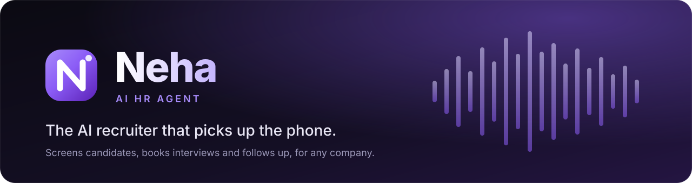
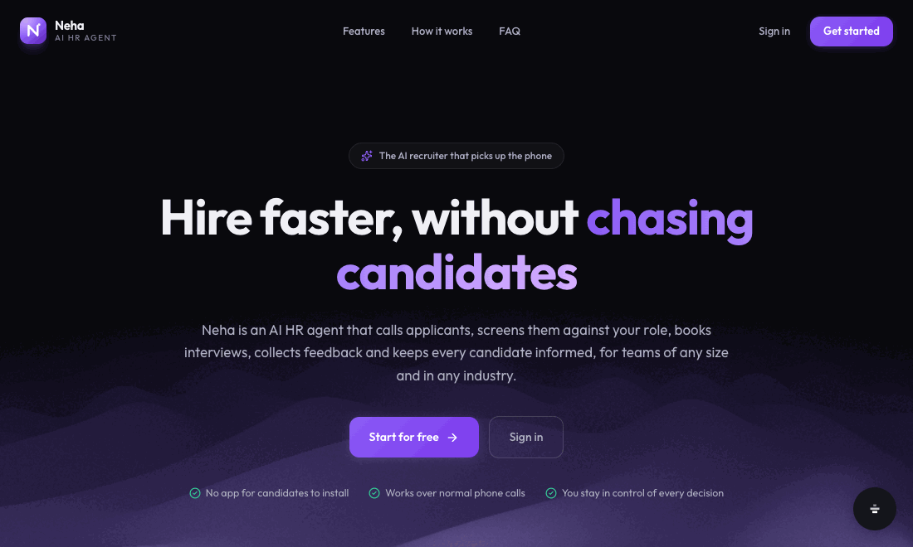
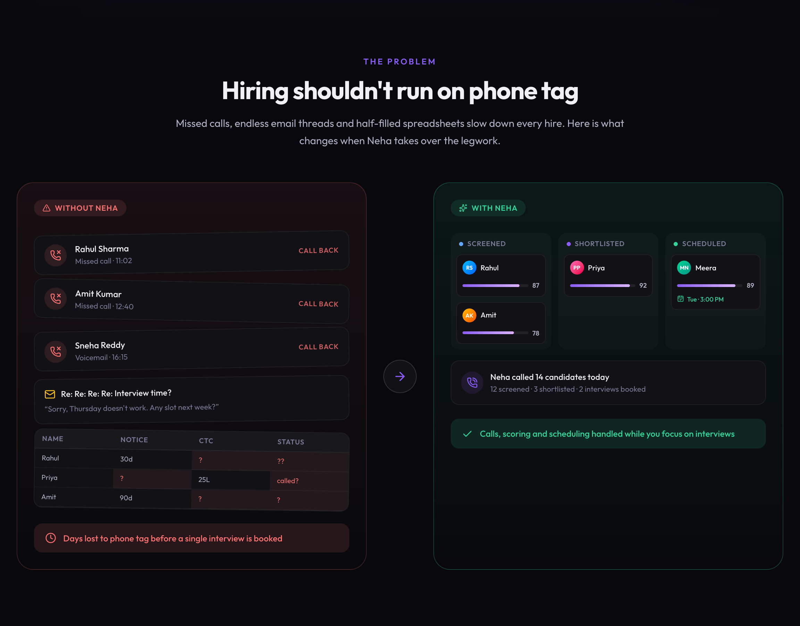
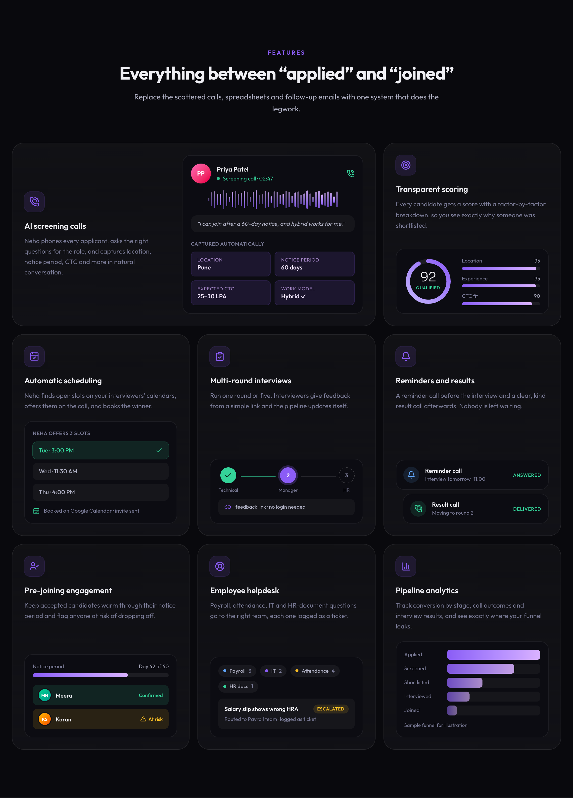
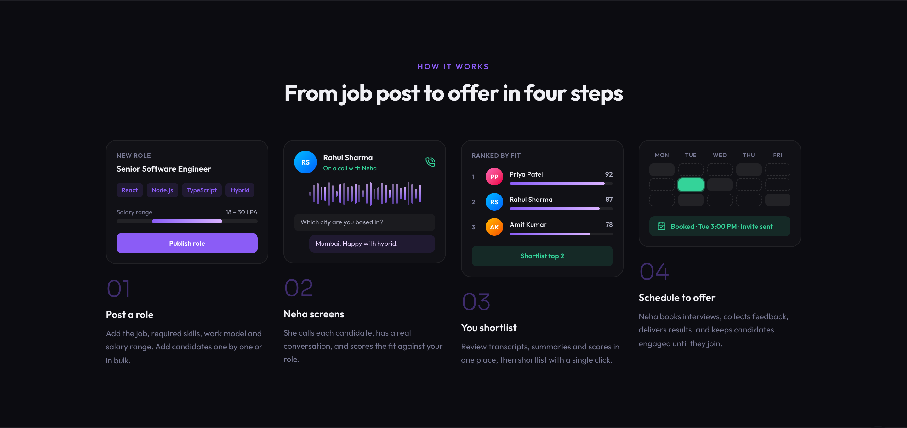
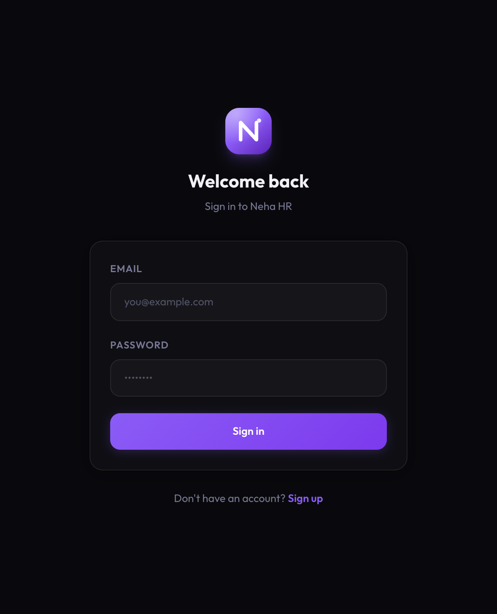
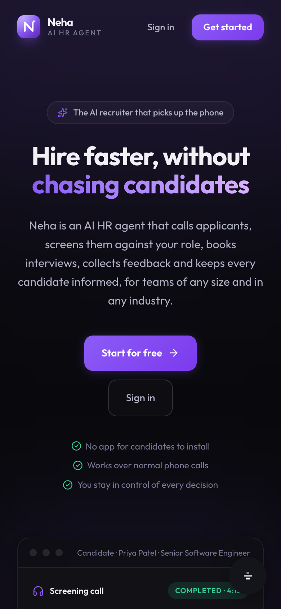
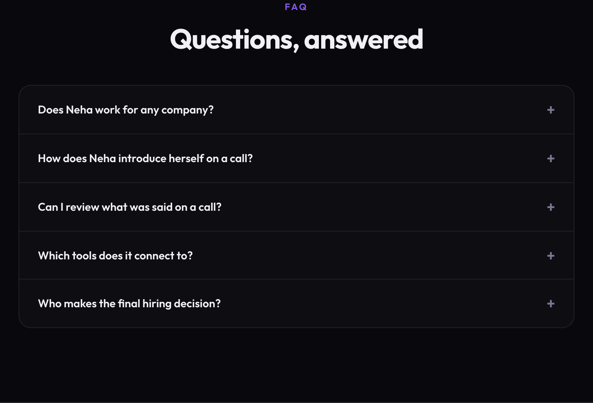
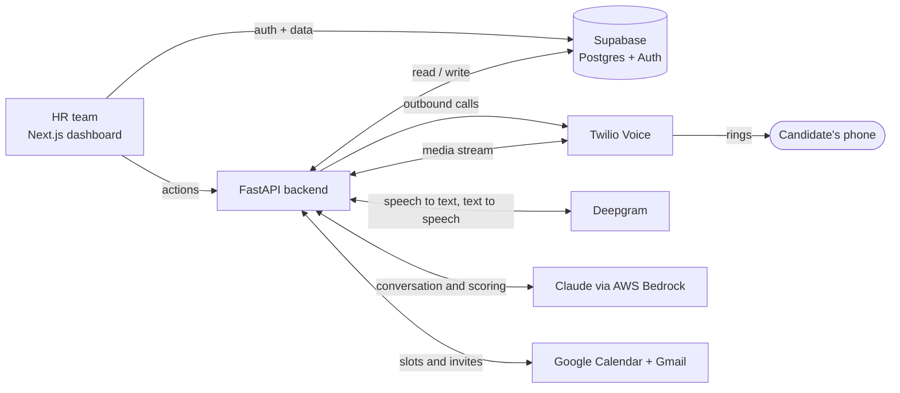
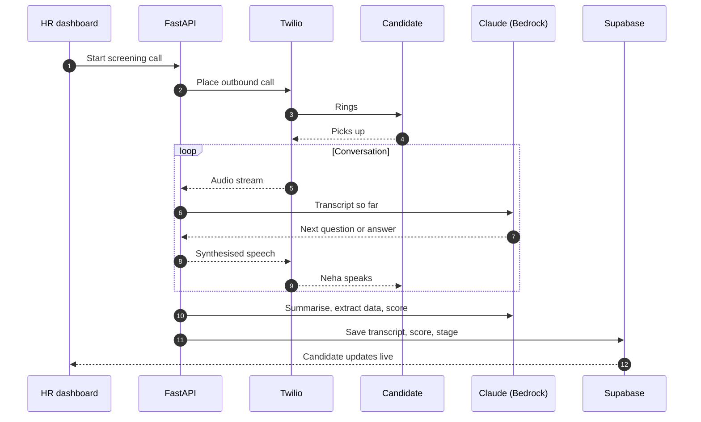

<div align="center">



<br />

[](https://nehahr.vercel.app)
&nbsp;
[](https://github.com/Vikasverma9515/nehahr/stargazers)
&nbsp;
[](https://github.com/Vikasverma9515/nehahr/commits/main)


**[Live demo](https://nehahr.vercel.app)** · **[Features](#-features)** · **[How it works](#-how-it-works)** · **[Architecture](#-architecture)** · **[Get started](#-getting-started)** · **[Deploy](#-deployment)**

</div>

<br />

<p align="center">
  
</p>

## Why Neha

Hiring runs on phone tag. Recruiters spend their days dialing candidates who don't pick up, retyping the same answers into spreadsheets, and trading emails just to find one interview slot.

**Neha is an AI HR agent that does that legwork.** She phones every applicant, has a real conversation, scores the fit against your role, books the interview on your interviewers' calendars, chases feedback, and keeps candidates warm until day one. Your team stays in control of every decision.

It is not tied to one company or industry: you define the roles, the screening criteria and the interview process, and Neha adapts to them.

<p align="center">
  
</p>

## ✨ Features

<p align="center">
  
</p>

| | Feature | What it does |
|---|---|---|
| 📞 | **AI screening calls** | Calls each applicant, asks role-specific questions and captures location, notice period, CTC and more from natural conversation. |
| 🎯 | **Transparent scoring** | Every candidate gets a score with a factor-by-factor breakdown, so you can see why someone was shortlisted or filtered out. |
| 📅 | **Automatic scheduling** | Finds open slots on interviewers' Google Calendars, offers them on the call, and books the winner. No email ping-pong. |
| 📝 | **Multi-round interviews** | One round or five. Interviewers submit feedback from a simple link with no account, and the pipeline updates itself. |
| 🔔 | **Reminders and results** | A reminder call before the interview and a clear, kind result call afterwards. |
| 🤝 | **Pre-joining engagement** | Keeps accepted candidates engaged through their notice period and flags anyone at risk of dropping off. |
| 🛟 | **Employee helpdesk** | Routes payroll, attendance, IT and HR-document questions to the right team, each logged as a ticket. |
| 📊 | **Pipeline analytics** | Conversion by stage, call outcomes and interview results, so you can see where the funnel leaks. |

## 🧭 How it works

<p align="center">
  
</p>

1. **Post a role.** Add the job, skills, work model and salary range, then add candidates one by one or in bulk.
2. **Neha screens.** She calls each candidate, has a real conversation and scores the fit.
3. **You shortlist.** Review transcripts, AI summaries and scores in one place, then shortlist with a click.
4. **Schedule to offer.** Neha books interviews, collects feedback, delivers results and keeps candidates engaged until they join.

Candidates move through one pipeline: `New → Screening → Screened → Shortlisted → Scheduled → Interviewing → Offer → Joined`.

## 🖼️ Screens

<table>
  <tr>
    <td align="center" width="62%"><br /><sub>Sign in</sub></td>
    <td align="center" width="38%"><br /><sub>Responsive on mobile</sub></td>
  </tr>
</table>

<details>
<summary><b>More: FAQ section</b></summary>
<br />

</details>

## 🏗️ Architecture



**A screening call, end to end**



More detail lives in [`docs/ARCHITECTURE.md`](docs/ARCHITECTURE.md) and [`docs/CALL_FLOWS.md`](docs/CALL_FLOWS.md).

### Tech stack

| Layer | Technology |
|---|---|
| Dashboard | Next.js 16 (App Router), React 19, TypeScript, Tailwind CSS 4 |
| Auth and data | Supabase (Postgres, Auth, row-level security) |
| Backend API | FastAPI, Python 3.11+, Uvicorn, WebSockets |
| Telephony | Twilio Voice |
| Speech | Deepgram (speech-to-text and streaming text-to-speech) |
| AI | Claude (Haiku and Sonnet) through AWS Bedrock |
| Scheduling and email | Google Calendar API and Gmail |

## 🚀 Getting started

### Prerequisites

- Node.js 20+ and npm
- Python 3.11+
- A [Supabase](https://supabase.com) project
- For live calling: Twilio, Deepgram, AWS Bedrock and Google Cloud credentials, plus a public URL for Twilio webhooks (for example with [ngrok](https://ngrok.com))

### 1. Clone and install

```bash
git clone https://github.com/Vikasverma9515/nehahr.git
cd nehahr
npm install
cp .env.example .env
```

### 2. Set up the database

In the Supabase SQL editor, run the files in [`supabase/migrations`](supabase/migrations) in order (`001` to `007`). Optionally load [`supabase/seed.sql`](supabase/seed.sql) for sample jobs and candidates.

### 3. Configure environment variables

The dashboard and the backend both read the single `.env` at the repo root.

| Variable | Used by | Purpose |
|---|---|---|
| `NEXT_PUBLIC_SUPABASE_URL` | Dashboard | Supabase project URL |
| `NEXT_PUBLIC_SUPABASE_ANON_KEY` | Dashboard | Supabase anon (public) key |
| `SUPABASE_URL` / `SUPABASE_SERVICE_KEY` | Backend | Server-side database access. Never expose the service key to the browser. |
| `TWILIO_ACCOUNT_SID`, `TWILIO_AUTH_TOKEN`, `TWILIO_PHONE_NUMBER` | Backend | Outbound calling |
| `DEEPGRAM_API_KEY` | Backend | Speech recognition and synthesis |
| `AWS_BEARER_TOKEN_BEDROCK` | Backend | Claude via Bedrock |
| `GOOGLE_CLIENT_ID`, `GOOGLE_CLIENT_SECRET` | Backend | Calendar and Gmail OAuth |
| `BACKEND_URL`, `FRONTEND_URL` | Backend | Public URLs used in Twilio webhooks, OAuth redirects and CORS |
| `BACKEND_API_URL` | Dashboard (server) | Where the dashboard's server actions reach the backend. Defaults to `http://localhost:8000`. |
| `NEXT_PUBLIC_BACKEND_URL` | Dashboard (browser) | Where the browser reaches the backend (OAuth links, call audio, feedback form). Defaults to `http://localhost:8000`. |
| `HR_COMPANY_NAME`, `HR_SENDER_NAME`, `HR_REPLY_TO` | Backend | Branding used in candidate emails. Defaults to a neutral "Our Company". |

### 4. Run it

```bash
# Dashboard: http://localhost:3000
npm run dev
```

```bash
# Backend API: http://localhost:8000  (docs at /docs)
cd backend
pip install -e .
uvicorn app.main:app --reload --port 8000
```

Open the dashboard, create an account, add a job and a candidate, and you are running.

> **No backend?** The dashboard, authentication and all Supabase-backed pages work on their own. Only the actions that place calls or talk to Google (starting a call, scheduling, connecting a calendar) need the backend.

## ☁️ Deployment

Neha ships as two services: the **dashboard** on Vercel and the **backend** on any Docker host. The dashboard works on its own (auth, candidates, jobs, analytics). The backend adds calling, scheduling and Google integration.

### Dashboard on Vercel

1. Import this repo in [Vercel](https://vercel.com/new). Every push to `main` then redeploys.
2. Under **Settings → Environment Variables**, add `NEXT_PUBLIC_SUPABASE_URL` and `NEXT_PUBLIC_SUPABASE_ANON_KEY`.
3. In Supabase, open **Authentication → URL Configuration** and set the Site URL to your Vercel URL.
4. Redeploy once so the public variables are baked into the build.

### Backend on Render (or Railway, Fly.io)

The repo includes a [`Dockerfile`](backend/Dockerfile) and a [`render.yaml`](render.yaml) blueprint.

1. In Render, choose **New → Blueprint** and select this repo. Render reads `render.yaml` and asks for each secret.
2. Set `BACKEND_URL` to the service's public URL and `FRONTEND_URL` to your dashboard URL.
3. Back on Vercel, add `BACKEND_API_URL` and `NEXT_PUBLIC_BACKEND_URL`, both set to the backend URL, and redeploy.
4. Nothing to configure in the Twilio console. The backend passes its own webhook URLs (`/api/webhooks/twilio/voice`, `/status` and `/recording`) with every outbound call, so `BACKEND_URL` just needs to be a public HTTPS address (see [`docs/CALL_FLOWS.md`](docs/CALL_FLOWS.md)).

Use an always-on instance for the backend. Live calls stream audio over WebSockets and a background scheduler sends reminders, so serverless functions and sleeping free tiers are not a fit. CORS already allows `*.vercel.app` and your `FRONTEND_URL`.

The full checklist is in [`docs/DEPLOYMENT.md`](docs/DEPLOYMENT.md).

## 🗂️ Project structure

```text
nehahr/
├── app/                    # Next.js App Router
│   ├── page.tsx            # Landing page
│   ├── (auth)/             # Login and signup
│   ├── (dashboard)/        # Candidates, jobs, interviews, calls, analytics, helpdesk, settings
│   ├── feedback/[token]/   # Login-free interviewer feedback form
│   ├── actions/            # Server actions
│   ├── components/         # UI, logo, landing visuals
│   └── lib/supabase/       # Supabase clients and types
├── backend/                # FastAPI service
│   └── app/
│       ├── routers/        # candidates, calls, jobs, interviews, webhooks, auth
│       ├── services/       # call handling, scoring, calendar, speech
│       ├── agent/          # Conversation prompts and nodes
│       └── workers/        # scheduled reminders and follow-ups
├── supabase/               # SQL migrations and seed data
├── docs/                   # Architecture, call flows, deployment, screenshots
└── proxy.ts                # Auth-aware request proxy
```

## 🗺️ Roadmap

- [x] AI screening, scoring and candidate pipeline
- [x] Automatic interview scheduling with Google Calendar
- [x] Multi-round interviews and login-free feedback links
- [x] Reminder and result calls
- [x] Pre-joining engagement
- [x] Employee helpdesk and exit interviews
- [ ] Multi-workspace support, so many companies can share one deployment
- [ ] ATS and HRIS integrations
- [ ] Multilingual calls
- [ ] Bulk candidate import from CSV

## 🤝 Contributing

Issues and pull requests are welcome. For larger changes, please open an issue first so we can talk it through.

```bash
npm run lint      # lint the dashboard
npx tsc --noEmit  # type-check
```

## 🔒 Security

- Never commit `.env`. It is git-ignored, and only `.env.example` is tracked.
- The Supabase **service key** belongs to the backend only.
- Found a vulnerability? Please open a private security advisory on GitHub instead of a public issue.

<br />

<div align="center">

Built by [Vikas Verma](https://github.com/Vikasverma9515)

<sub>If Neha saves you a few phone calls, a ⭐ on the repo is very welcome.</sub>

</div>
